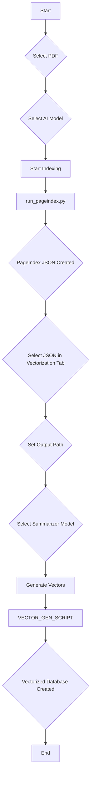
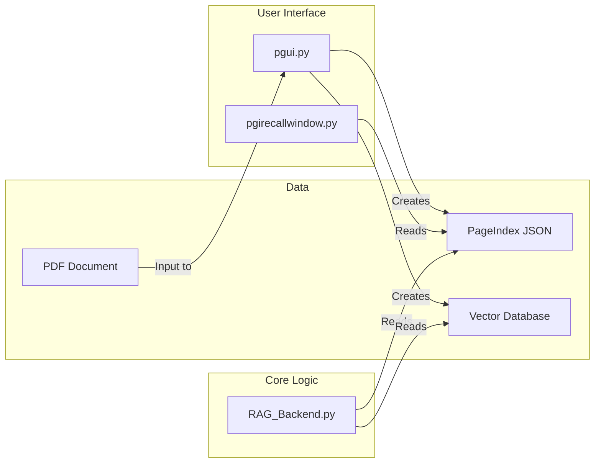

# Architectural Diagrams

This document contains diagrams that illustrate the architecture and workflow of the DeepSeek PageIndex RAG Test project. The diagrams are created using Mermaid.js syntax.

## 1. Data Preparation Workflow

This diagram shows the workflow for the data preparation process, which is managed by the `pgui.py` application.



## 2. RAG Backend Workflow

This diagram illustrates the workflow of the RAG backend, which is handled by the `RAG_Backend.py` module.

```mermaid
graph TD
    A[User Query] --> B{Rewrite Query};
    B --> C[LLM];
    C --> D{Rewritten Query};
    D --> E{Hybrid Search};
    E --> F[Vector Search];
    E --> G[Keyword Search];
    F --> H{Merge Results (RRF)};
    G --> H;
    H --> I{Rerank Results};
    I --> J[Reranker Model];
    J --> K{Top-Ranked Documents};
    K --> L{Generate Answer};
    L --> M[LLM];
    M --> N[Final Answer];
```

## 3. Component Interaction Diagram

This diagram shows how the different components of the system interact with each other.


